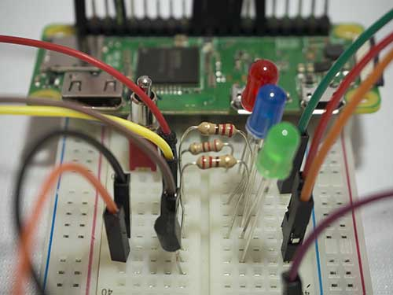

# Digital Making: Recipes for Raspberry Pi and Python

Code samples for use with the Raspberry Pi and Python.

Please go to [www.thinkcreatelearn.co.uk](www.thinkcreatelearn.co.uk) for more details.
